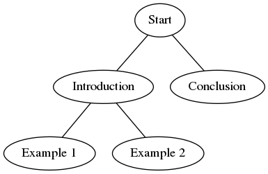

## latex-mindmapper

latex-mindmapper is a binary that parses .tex files for special `\lmmnode` commands and uses
those to create a DOT graph description. The goal is to allow building a mindmap inside the 
LaTeX file to make it easier to keep it up to date.

### Usage

1. Add the following no-op command to your .tex file, so that `\lmmnode` will not throw any errors: `\newcommand{\lmmnode}[3][]{}`
2. Insert `\lmmnode` commands into your .tex file
    - Syntax: `\lmmnode{<parent_id>}{<id>}[<label>]`
    - (example) root node: `\lmmnode{}{root}[Root node]`
    - (example) branch: `\lmmnode{root}{branch1}[Branch]`
3. Run `latex-mindmapper my-article.tex` to print DOT description of the file to stdout.

### Examples

Print examples/foo.tex mindmap to output.png using Graphviz:

`cargo run -- examples/foo.tex | dot -Tpng > output.png`

Produces



### Github action

Latex-mindmapper can be used as a Github action step:

```
on: [push]

jobs:
  hello_world_job:
    runs-on: ubuntu-latest
    name: A job to say hello
    steps:
    - name: Hello world action step
      id: hello
      uses: actions/hello-world-docker-action@v1
      with:
        who-to-greet: 'Mona the Octocat'
    # Use the output from the `hello` step
    - name: Get the output time
      run: echo "The time was ${{ steps.hello.outputs.time }}"
```
